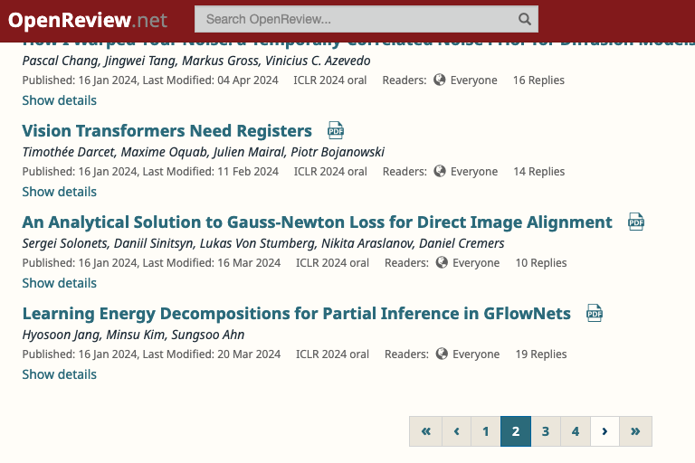

# OpenReview Conference Paper Crawler 🔥

Welcome to the OpenReview Conference Paper Crawler repository!

This repository provides a straightforward script for crawling data, designed to retrieve information about papers accepted at ML/DL conferences, as described in OpenReview (e.g., `NeurIPS`, `ICLR`, `EMNLP`).
As of now, this repo offers `paper title`, its `pdf link`, `authors`, `keywords` of papers from the specified conferences.


## Requirements

```
PyYAML >= 5.4.1
selenium >= 4.2.0
webdriver-manager >= 4.0.1
```

## 🌟 Usages

### Step 1. Select conference venue (in OpenReview)

- Configuration files for **EMNLP-2023**, **NeurIPS-2024**, and **ICLR-2024** are already prepared. Please refer to the `configs/{emnlp_2023|neurips_2023|iclr_2024}.yaml` files.
- For conferences other than these, you will need to gather some information to complete the fields in the configuration file.
    - `selections`: It depends on which conference you choose. The type of presentation (e.g., `oral`) can be inferred from URLs like **https://openreview.net/group?id=ICLR.cc/2024/Conference#accept-oral**

    - `page_indicators`: It is important to specify this information. 💫 

        - Specify the n-th `<li>` element that contains a right arrow (`>`) to indicate the button for navigating to the next page, as described in the image below.

          

### Step 2. Do crawling


- **NeurIPS 2023**, **ICLR 2024** 
```
# select among `oral`, `spotlight`, or `poster`
python main.py --headless --config_filepath ./configs/{neurips_2023|iclr_2024}.yaml --selection {oral|spotlight|poster}

# select all
python main.py --headless --config_filepath ./configs/{neurips_2023|iclr_2024}.yaml --all
```

- **EMNLP 2023** 
```
# select between `main`, or `findings`
python main.py --headless --config_filepath ./configs/{emnlp_2023}.yaml --selection {main|findings}

# select all
python main.py --headless --config_filepath ./configs/{emnlp_2023}.yaml --all
```

## Output format

- Currently, the output file (`.json`) includes fields for **title**, **link**, **authors**, and **keywords** fields. Each line of the output JSON file contains these four keys and their respective values. Please refer to the sample output file in `./outputs/ICLR-2024/oral_paper.json`
- Other fields (e.g., **abstract**) can also be accessed (but not implemented yet). 
